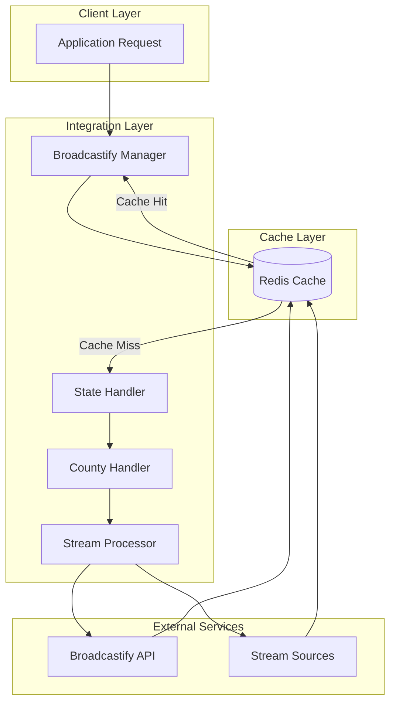

# Broadcastify Integration Guide

## Prerequisites

- Python 3.7+
- `requests` library
- API credentials from Broadcastify
- Understanding of REST APIs

## System Architecture



The diagram highlights the components involved in the integration:

- Pink components represent client-facing elements.
- Blue indicates the caching layer for performance optimization.
- Green shows the core integration logic.
- Yellow represents external dependencies.

## Processing Flow

Requests are handled hierarchically:

1. Requests check the Redis cache for existing data.
2. Uncached requests flow through the state → county → stream processors.
3. Both the Broadcastify API and direct stream sources contribute to the cached data.

## Implementation

```python
import os
import json
import redis
import requests
from typing import Dict, List, Optional
from datetime import datetime, timedelta

class BroadcastifyManager:
    def __init__(self):
        self.api_key = os.environ.get('BROADCASTIFY_API_KEY')
        self.base_url = 'https://api.broadcastify.com'
        self.redis_client = redis.Redis(host='localhost', port=6379, db=0)
        self.cache_ttl = timedelta(hours=24).total_seconds()

    def _get_cached_or_fetch(self, cache_key: str, fetch_func) -> Dict:
        """Helper method to check cache first, then fetch if needed"""
        cached = self.redis_client.get(cache_key)
        if cached:
            return json.loads(cached)
        
        result = fetch_func()
        self.redis_client.setex(
            cache_key,
            self.cache_ttl,
            json.dumps(result)
        )
        return result

class StateHandler:
    def __init__(self, broadcastify_manager: BroadcastifyManager):
        self.manager = broadcastify_manager
        
    def get_state_feeds(self, state_id: str) -> List[Dict]:
        """Retrieve all feeds for a specific state"""
        cache_key = f"broadcastify:state:{state_id}:feeds"
        
        def fetch_func():
            response = requests.get(
                f"{self.manager.base_url}/calls/states/{state_id}",
                headers={'Authorization': f"Bearer {self.manager.api_key}"}
            )
            response.raise_for_status()
            return response.json()
            
        return self.manager._get_cached_or_fetch(cache_key, fetch_func)

class CountyHandler:
    def __init__(self, broadcastify_manager: BroadcastifyManager):
        self.manager = broadcastify_manager
        
    def get_county_feeds(self, county_id: str) -> List[Dict]:
        """Retrieve feeds for a specific county"""
        cache_key = f"broadcastify:county:{county_id}:feeds"
        
        def fetch_func():
            response = requests.get(
                f"{self.manager.base_url}/calls/counties/{county_id}",
                headers={'Authorization': f"Bearer {self.manager.api_key}"}
            )
            response.raise_for_status()
            return response.json()
            
        return self.manager._get_cached_or_fetch(cache_key, fetch_func)

class StreamProcessor:
    def __init__(self, broadcastify_manager: BroadcastifyManager):
        self.manager = broadcastify_manager
        
    def process_stream(self, feed_data: Dict) -> Optional[str]:
        """Process and validate stream data"""
        if not feed_data.get('active') or not feed_data.get('stream_url'):
            return None
            
        stream_url = feed_data['stream_url']
        
        # Validate stream URL format
        if not self._is_valid_stream_url(stream_url):
            return None
            
        return stream_url
        
    def _is_valid_stream_url(self, url: str) -> bool:
        """Validate stream URL format"""
        return url.startswith(('http://', 'https://'))
```

### Initialization

```python
broadcastify_manager = BroadcastifyManager()
state_handler = StateHandler(broadcastify_manager)
county_handler = CountyHandler(broadcastify_manager)
stream_processor = StreamProcessor(broadcastify_manager)
```

### Processing States and Counties

```python
def process_all_feeds():
    # Get all states
    states_response = requests.get(
        f"{broadcastify_manager.base_url}/calls/states",
        headers={'Authorization': f"Bearer {broadcastify_manager.api_key}"}
    )
    
    for state in states_response.json():
        state_id = state['id']
        print(f"Processing state: {state_id}")
        
        # Process county feeds
        county_feeds = county_handler.get_county_feeds(state_id)
        for county_feed in county_feeds:
            processed_stream = stream_processor.process_stream(county_feed)
            if processed_stream:
                yield {
                    'state': state_id,
                    'county': county_feed['county'],
                    'stream_url': processed_stream
                }
```

## Error Handling and Monitoring

```python
class IntegrationMonitor:
    def __init__(self):
        self.error_threshold = 5  # Number of consecutive failures
        self.failure_counts = {}
        
    def track_error(self, state_id: str, error: Exception):
        """Track integration errors and raise alerts"""
        if state_id not in self.failure_counts:
            self.failure_counts[state_id] = []
            
        self.failure_counts[state_id].append({
            'timestamp': datetime.now(),
            'error': str(error)
        })
        
        if len(self.failure_counts[state_id]) >= self.error_threshold:
            self._raise_alert(state_id)
            
    def _raise_alert(self, state_id: str):
        """Implement alerting logic (e.g., email, Slack, etc.)"""
        pass
```

## Deployment Considerations

1. **Environment Setup**

   ```bash
   export BROADCASTIFY_API_KEY='your_api_key_here'
   export REDIS_HOST='localhost'
   export REDIS_PORT=6379
   ```

2. **Performance Optimization**
   - Implement rate limiting for API calls.
   - Use connection pooling for Redis.
   - Batch process large datasets.
   - Monitor cache hit ratios.

3. **Monitoring Requirements**
   - Track API response times.
   - Monitor cache effectiveness.
   - Set up alerts for integration failures.
   - Log processing statistics.

This guide provides a foundation for integrating Broadcastify streams across states and counties. The caching layer improves resource utilization, while the modular design enables easier maintenance and expansion.
